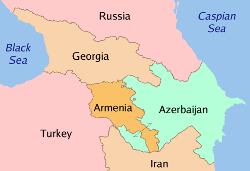

<br><p style = "font-family: verdana;font-size: 8pt;"> Published on: 2021-09-17 </p>
<br><p style = "font-family: verdana;font-size: 8pt;"> Updated on: `r Sys.Date()` </p>

```{r setup, include=FALSE}
knitr::opts_chunk$set(echo = FALSE, warning = FALSE, message = FALSE)

```

```{r libraries}
# remotes::install_github('htmlwidgets/sparkline')

library(distill)
library(readr)
library(tidyverse)
library(ggplot2)
library(plotly)
library(lubridate)
library(sparkline)
library(DT)
library(formattable)
library(scales)
library(quantmod)
library(skimr)
library(unglue)
library(hrbrthemes)
library(viridis)
library(ggridges)
library(dygraphs)
library(xts) 
library(kableExtra)

```


```{r, reading, eval=FALSE}

cases <- read.csv(here::here("data/covid-tests-cases-deaths.csv")) %>%
  select(Entity, Day, 
         Total.confirmed.deaths.due.to.COVID.19,
         Total.confirmed.cases.of.COVID.19) %>%
  filter(Entity == "Azerbaijan")%>%
  mutate(Day = ymd(Day),
         day = day(Day),
         month = month(Day),
         year = year(Day)) %>%
  rename(country= Entity, Date = "Day", 
         cases= Total.confirmed.cases.of.COVID.19,
         deaths= Total.confirmed.deaths.due.to.COVID.19)

  
gdp <- read.csv(here::here("data/gdp-growth.csv")) %>%
  select(RegionalMember, Year, GDP.growth) %>%
  filter(RegionalMember == "Azerbaijan") %>%
  rename(country= RegionalMember,
         gdp= GDP.growth)
  

war <- read.csv(here::here("data/Caucasus_and_Central_Asia.csv"))%>%
  filter(country == "Azerbaijan", str_detect(notes, "Armenia|Artsakh")) %>% 
  select(country, location, latitude, longitude, event_date, fatalities, notes) %>%
  mutate(event_date = as.Date(event_date, format = "%d %b %Y"),
         day = day(event_date),
         month = month(event_date), 
         year = year(event_date)) %>%
  rename(Date = "event_date")

  
```


```{r, map}

map_df <- map_data("world") %>% 
  filter(region %in%  c("Azerbaijan", "Armenia")) %>%
  rename(country = region) %>%
  select(country, long, lat, group)

centroid <- aggregate(cbind(long,lat) ~ country, data=map_df, FUN=mean)

ggplotly (ggplot() +
          geom_polygon(data = map_df, aes(long, lat, group = group, fill = country)) +
          geom_text(data = centroid, mapping = aes(x=long, y=lat, label=country)) +
          ggtitle(" War Tension") + 
          geom_path(color = "white") +
          scale_fill_hue(l=40) +
          coord_equal() +
          theme_bw() +
          theme(legend.position = "none", 
                  title = element_blank(),
                  axis.ticks = element_blank(),
                  axis.text = element_blank()))
  
  
```


## Introduction 

<p>    

</p>


## Data Story 

<p>    

</p> 


## Data Structure 
<p> I have used three datasets from different sources for the analysis.

### Data 
```{r}

data1 <- tibble(Variables = c("country",
                              "Day",
                              "deaths",
                              "cases",
                              "day",
                              "month",
                              "year"),
                         
                Class = c("character",
                          "date",
                          "integer",
                          "integer",
                          "integer",
                          "double",
                          "double"),
       
       
               Description = c("country name",
                               "date given in the initial data",
                               "total number of deaths due to covid",
                               "total number of cases of covid",
                               "day extracted from given date",
                               "month extracted from given date",
                               "year extracted from given date"))


data2 <- tibble(Variables = c("country",
                              "Year",
                              "gdp"),
                         
                Class = c("character",
                          "character",
                          "double"),
       
       
               Description = c("country name",
                               "year from 2016 to 2022 forecast",
                               "gdp of the country for each year"))

 
data3 <- tibble(Variables = c("location",
                              "latitude",
                              "longitude",
                              "event_date",
                              "fatalities",
                              "notes",
                              "day",
                              "month",
                              "year"),
                         
                Class = c("character",
                          "double",
                          "double",
                          "date",
                          "integer",
                          "character",
                          "integer",
                          "double",
                          "double"),
       
       
               Description = c("locations affected in the country",
                               "latitude of the location",
                               "longitude of the location",
                               "date given in the initial data",
                               "fatalities during the war in 2020",
                               "description of the incident which caused casualties",
                               "day extracted from given date",
                               "month extracted from given date",
                               "year extracted from given date"))


```

```{r}

dt <- rbind.data.frame(data1, data2, data3)

kbl(dt[1:19, 1:3], caption = "Daataset used for the Analysis") %>%
  kable_paper("striped", full_width = F) %>%
  pack_rows("Dataset 1", 1,7, label_row_css = "background-color: #666; color: #fff;") %>%
  pack_rows("Dataset 2", 8,10, label_row_css = "background-color: #666; color: #fff;") %>%
  pack_rows("Dataset 3", 11,19, label_row_css = "background-color: #666; color: #fff;")

```
<p style = "font-family: verdana;font-size: 8pt;">Sources:</p>

<p style = "font-family: verdana;font-size: 8pt;"> 
Dataset 1: <a href="https://ourworldindata.org/coronavirus/country/azerbaijan"> Our World in Data </a> </p>

<p style = "font-family: verdana;font-size: 8pt;"> 
Dataset 2: <a href="https://www.adb.org/countries/azerbaijan/economy"> Asian Development Bank </a> </p>

<p style = "font-family: verdana;font-size: 8pt;"> 
Dataset 3: <a href="https://acleddata.com/data-export-tool/"> ACLED </a> </p>


## COVID-19 in Azerbaijan 

```{r, eval = FALSE}
#density for cases and deaths
den <- cases %>%
  group_by(month) %>%
  summarise(cases = sum (cases)/1000000,
            deaths = sum (deaths)/1000000)%>%
  pivot_longer(cols = c(cases, deaths),
               names_to = "variables",
               values_to = "value")
  
ggplotly(ggplot( den, aes(x= value, group=variables, fill=variables)) +
  geom_density(adjust=1.5, alpha=.3)+ 
  theme_ipsum()+ 
  scale_x_log10()+
  labs(x= "Cumulative Cases and Deaths",
       y= "Density",
       title = "Covid-19 in Azerbaijan"))


#Boxplot for cases and deaths
cases %>% rename(case = cases) %>%
  pivot_longer(cols = c(cases, deaths),
               names_to = "variables",
               values_to = "value") %>%
  ggplot(aes(x=variables, y=value, fill=variables)) + 
    geom_boxplot(adjust=1.5, alpha=.3)+ 
  theme_ipsum()+ 
    scale_y_log10()+
  facet_wrap(~year)


#series for cases and deaths

plot1 <- cases %>%
  select(Date, deaths, cases)

corona = xts( x = plot1 [,-1], order.by= plot1$Date)
dygraph(corona) %>%
dyOptions( fillGraph=TRUE)%>%
  dyRangeSelector() %>%
  dyCrosshair(direction = "vertical") %>%
  dyHighlight(highlightCircleSize = 5, highlightSeriesBackgroundAlpha = 0.2, hideOnMouseOut = FALSE)  %>%
  dyRoller(rollPeriod = 1)

```


## Death Toll Comparison

```{r, eval = FALSE}
new <- war %>%
    select(Date, fatalities) %>%
    left_join(cases, by = "Date") %>%
  mutate(month = as.factor(month),
         month = month(Date, label = TRUE))%>%
  filter(year == 2020,
         month %in% c("Sep", "Oct", "Nov")) %>%
  pivot_longer(cols = c(fatalities, deaths),
               names_to = "type",
               values_to = "demise") 


ggplot(new,aes(x = demise, y = month ))+
  geom_density_ridges_gradient(scale = 3, rel_min_height = 0.01)+
  scale_fill_viridis() +
  theme_ipsum() +
  labs(x= "Deaths",
       y= "Months",
       title = "Total number of deaths")


# Deaths due to war `r sum(new$fatalities)`
# Deaths due to COVID `r sum(new$deaths)`

```


```{r , eval = FALSE}

#box plot
war_deaths <- war %>%
    select(Date, fatalities) %>%
    left_join(cases, by = "Date") %>%
  rename("War" = "fatalities",
         "COVID" = "deaths") %>%
  pivot_longer(cols = c(War, COVID),
               names_to = "type",
               values_to = "demise") 
  
ggplotly(ggplot(war_deaths, aes(x=type, y=demise, fill=type)) + 
    geom_boxplot()+
    scale_y_log10()+
    stat_summary(fun.y=mean, geom="point", shape=20, 
                 size=4, color="red", fill="red") +
    coord_flip()+ 
    theme_bw() +
    theme(legend.position="none",
          plot.title = element_text(size=16),
          axis.title.x = element_text(size=12) ) +
      
    labs(x = "", y = "Number of people who died",
         title = "Breakdown of Deaths"))


```


```{r, eval = FALSE}

# Series for death comparison
plot2 <- war %>%
    select(Date, fatalities) %>%
    left_join(cases, by = "Date") %>%
    rename("War" = "fatalities",
         "COVID" = "deaths")%>%
  filter(year == 2020,
         month %in% c(9, 10, 11))%>%
    select(Date, War, COVID)
  


total = xts( x = plot2 [,-1], order.by= plot2$Date)
dygraph(total) %>%
dyOptions( fillGraph=TRUE)%>%
  dyRangeSelector() %>%
  dyCrosshair(direction = "vertical") %>%
  dyHighlight(highlightCircleSize = 5, highlightSeriesBackgroundAlpha = 0.2, hideOnMouseOut = FALSE)  %>%
  dyRoller(rollPeriod = 1)


  
```

## Eonomic Impact
```{r, eval = FALSE}

ggplotly(ggplot(gdp, aes(x= Year, y = gdp, fill = Year))+
  geom_bar(stat="identity", position = "dodge") +
  geom_text(aes(label=sprintf("%1.1f%%", gdp)), 
            position = position_stack(vjust= 0.5),
            colour = "white", size = 3) +
    scale_fill_manual(values = c("#CD5C5C","#32CD32","#228B22",
                                 "#006400", "#B22222","#228B22","#006400" ))+
    scale_y_continuous(breaks = seq(-4.5, 3, by = .5))+
    theme_bw()+
    theme(legend.position = "none")+
    labs(y = "GDP in Percent",
         title = "Eonomic Impact over the years"))

```

## Conclusion
```{r, echo = F, out.width = '50%', fig.align='center'}


```


## References 

- Websites:

  Ritchie, H. (2020, March 5). Belgium: Coronavirus Pandemic Country Profile. Our World in
Data. https://ourworldindata.org/coronavirus/country/belgium

- R libraries:

Hadley Wickham and Dana Seidel (2020). scales: Scale Functions for
  Visualization. R package version 1.1.1.
  https://CRAN.R-project.org/package=scales

Jeffrey A. Ryan and Joshua M. Ulrich (2020). quantmod: Quantitative
  Financial Modelling Framework. R package version 0.4.18.
  https://CRAN.R-project.org/package=quantmod

  C. Sievert. Interactive Web-Based Data Visualization with R, plotly,
  and shiny. Chapman and Hall/CRC Florida, 20

Garrett Grolemund, Hadley Wickham (2011). Dates and Times Made Easy
  with lubridate. Journal of Statistical Software, 40(3), 1-25. URL
  https://www.jstatsoft.org/v40/i03/.

H. Wickham. ggplot2: Elegant Graphics for Data Analysis.
  Springer-Verlag New York, 2016.


Hadley Wickham and Jim Hester (2021). readr: Read Rectangular Text
  Data. R package version 2.0.0.
  https://CRAN.R-project.org/package=readr

Hadley Wickham and Dana Seidel (2020). scales: Scale Functions for
  Visualization. R package version 1.1.1.
  https://CRAN.R-project.org/package=scales

JJ Allaire, Rich Iannone, Alison Presmanes Hill and Yihui Xie (2021).
  distill: 'R Markdown' Format for Scientific and Technical Writing. R
  package version 1.2. https://CRAN.R-project.org/package=distill

Kun Ren and Kenton Russell (2021). formattable: Create 'Formattable'
  Data Structures. R package version 0.2.1.
  https://CRAN.R-project.org/package=formattable

Ramnath Vaidyanathan, Kent Russell and Gareth Watts (2016).
  sparkline: 'jQuery' Sparkline 'htmlwidget'. R package version 2.0.
  https://CRAN.R-project.org/package=sparkline

Yihui Xie, Joe Cheng and Xianying Tan (2021). DT: A Wrapper of the
  JavaScript Library 'DataTables'. R package version 0.18.
  https://CRAN.R-project.org/package=DT
  


